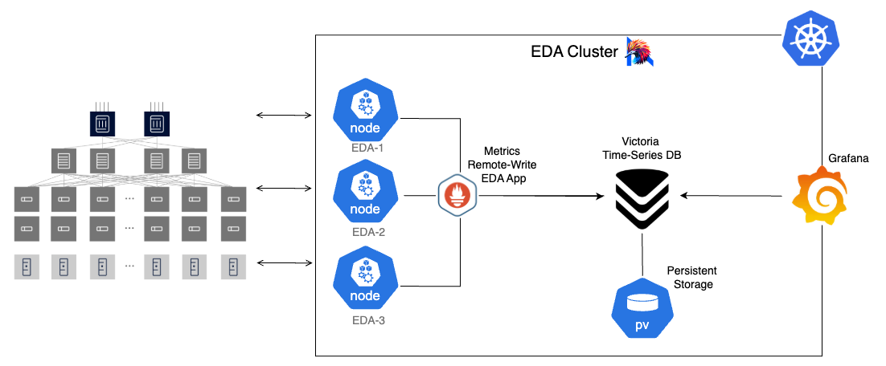

# Streaming Telemetry for AI Data Center Fabrics

**Remote Write → VictoriaMetrics → Grafana**

High-rate, low-latency streaming telemetry for AI/DC network fabrics with scalable time-series storage and interactive observability dashboards.

## Architecture



## Quick Start

1. Clone the repo if you haven't already:
```
git clone https://github.com/nokia/nokia-validated-designs/tree/main/validated-designs/ai-dc/two-stripe-rail-optimized
```

Change the directory

2. Bring up stack 

```
./install_telemetry_stack.sh
```

3. Access UIs


| Service          | URL                          | Default Credentials      |
|------------------|-----------------------------|---------------------------|
| VictoriaMetrics  | http://<host>:8428         | N/A                       |
| Grafana          | http://<host>:3000         | admin / admin            |

